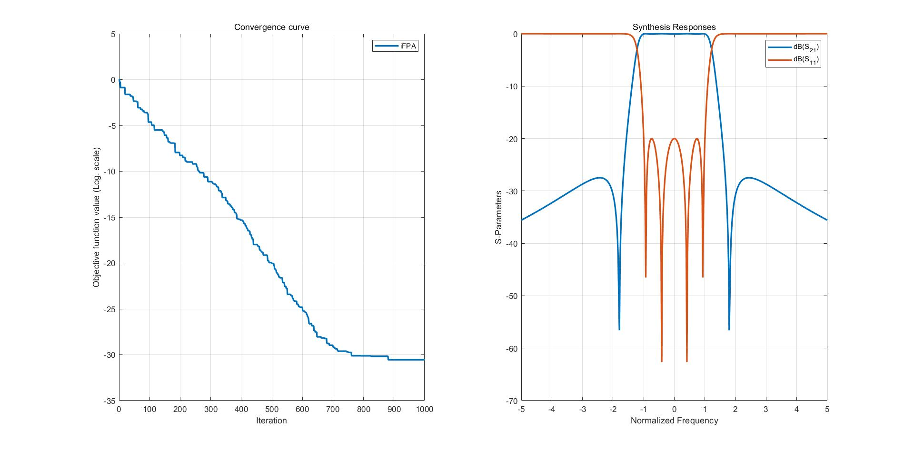
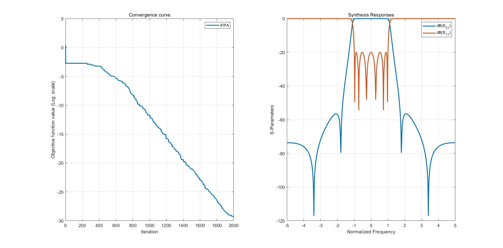
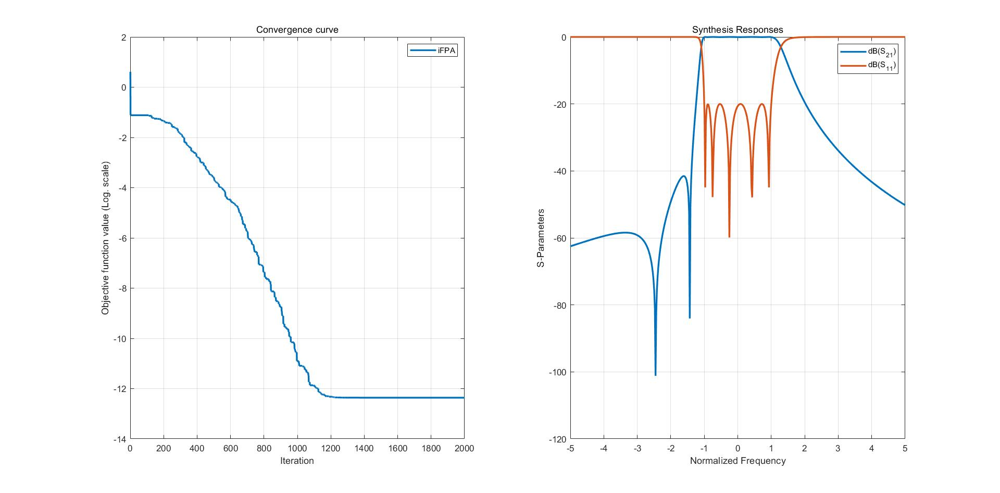

# filterOptim
This is the source code for research paper titled "Improved Flower Pollination Algorithm for Synthesis of Cross-coupled Filters";

Author: Pei-Wen Shu, Qing-Xin Chu;

Date: 30/01/2021;

Email: eespw@mail.scut.edu.cn;

All the references are properly cited in this paper;

Copyright: MIT ;

Anyone who wishes to use/cite this project or has problems, please contact us.

### Three different .m files:
#### 1. Main_filter1, Main_filter2, Main_filter3:

One could excute them directly to investigate all the examples in this paper;

#### 2. Objfunc1, Objfunc2, Objfunc3:

The objective functions for each filter;

#### 3. PlotResponse_filter1, PlotResponse_filter2, PlotResponse_filter3:

Filter response from the synthesized coupling matrix;

#### 4. iFPA

The improved flower pollination algorithm;

More detailed toturials will be added later.

##### Results
Example1:

Example2:

Example3:

